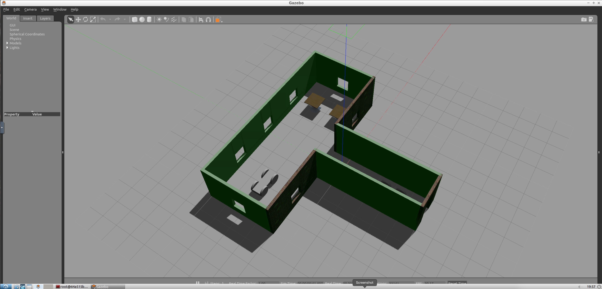

# Udacity Robotics Nanodegree
# Project #1: My World



## Introduction
This is a project for Udacity's Robotics NanoDegree. It's a simulated world built in Gazebo that includes a building, a robot, and a plugin.

## Concepts and Classes
Concepts explored in this project:

  - Gazebo model and world-building
  - Gazebo plugins
  - C++

## Getting Started
To view this project, you must have Gazebo installed on Linux. [Click here for Gazebo download and installation instructions](http://gazebosim.org).

With Gazebo installed, clone the repository and navigate to the root directory. You first must build the plugin, so create a build folder and navigate to it:

```
$ mkdir build && cd build
```
Then build the plugin:

```
$ cmake .. && make
```
Once the plugin is built, navigate back to the root directory and open the world in Gazebo:

```
$ gazebo world/timsWorld
```

The world should open in Gazebo, and the terminal should display the message:

```
Welcome to Tim's world!
```